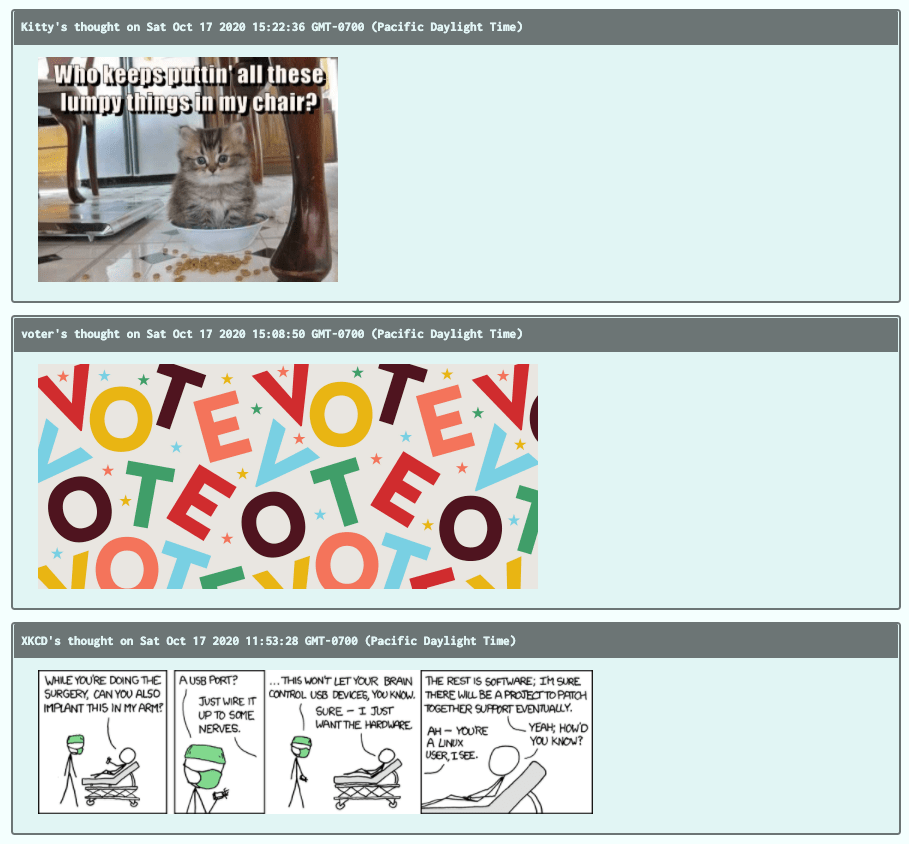

# aws-thought

## Description
Amazon Web Services, commonly known as AWS, is currently the most comprehensive and widely adopted cloud platform. In this project, I refactored the existing MERN application Deep Thoughts, which allows users to sign up and create an account, post their thoughts, and share their thoughts and images with other users. Deployed this app to the cloud using AWS and replace the back-end API to use cloud resources for storage, database, and computing. To accomplish this, I configured a database service with DynamoDB, store and retrieve static assets using S3, and deploy the app on an Ubuntu server to an EC2 instance.
 

  ## Table of Contents

* [Installation](#installation)
* [License](#license)
* [Mockup](#mockup)
* [Questions](#questions)

## Installation 
After cloning the repo, run `npm i` to install the dependencies from the root, the server and the client folder.

To start the application, run from the root directory:
`npm start`. 

## License

## Mockup

## Questions
If you have any questions about this project, contact us through my[GitHub](https://github.com/lizariasc).